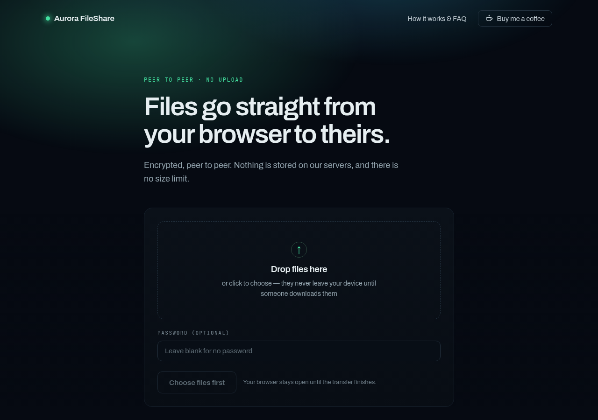
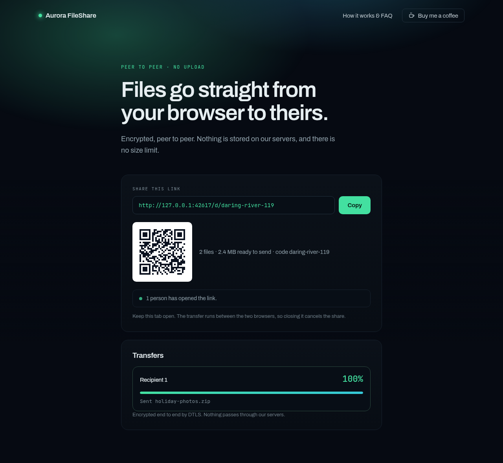
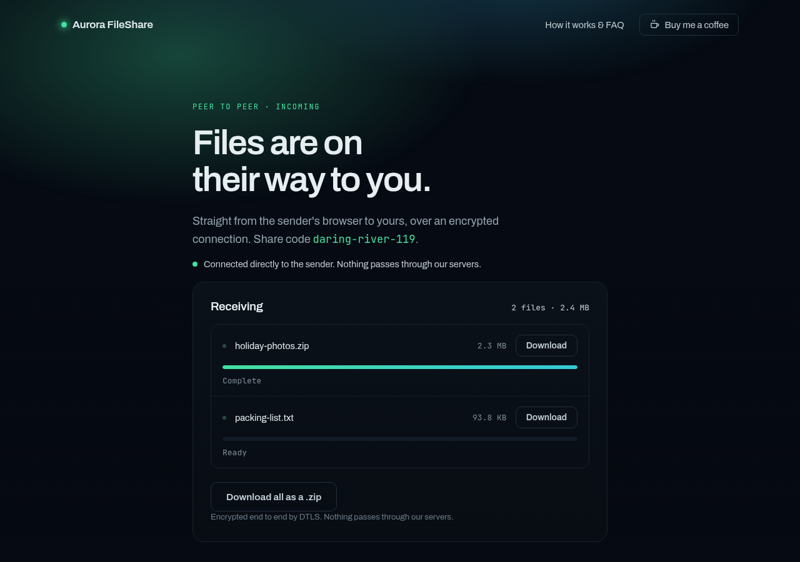
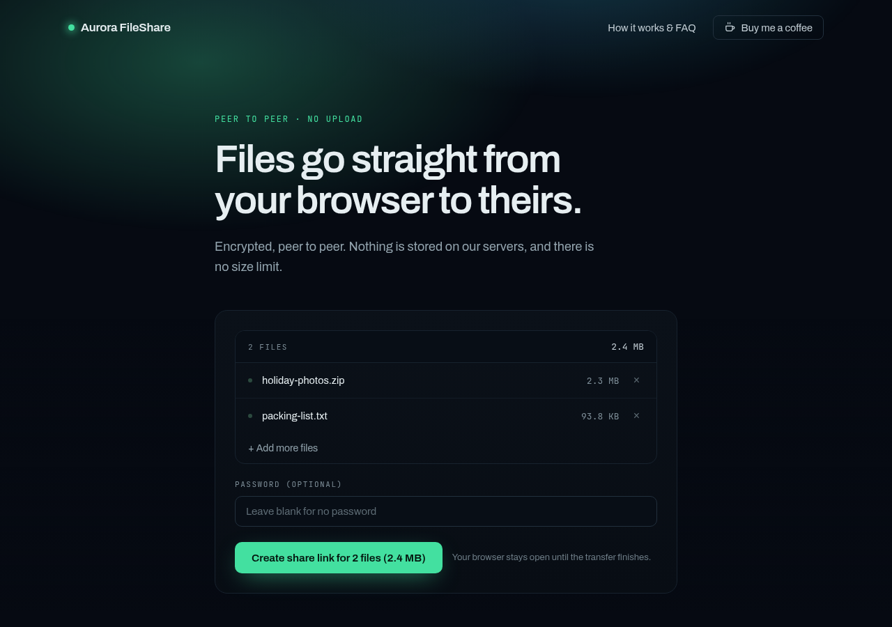
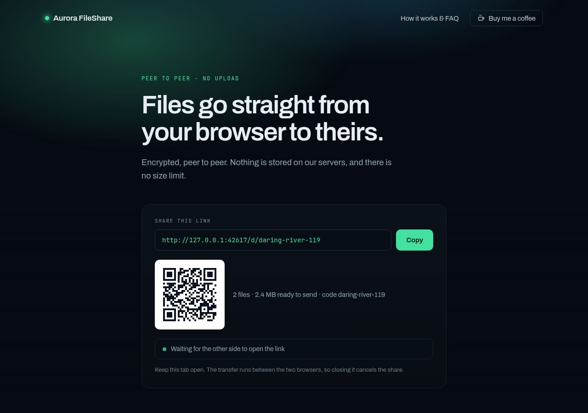
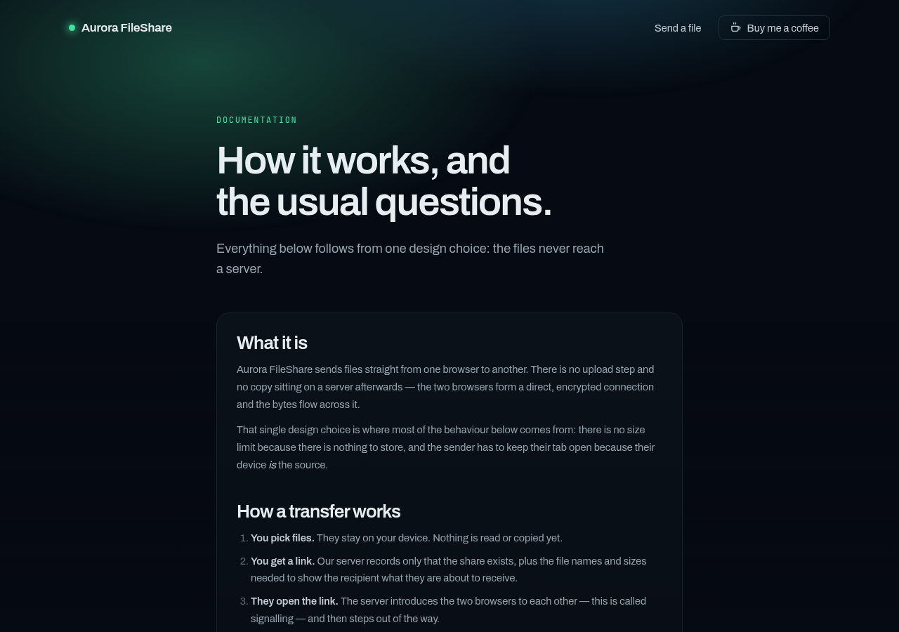

# Aurora FileShare

Peer-to-peer file transfers in the browser, in the spirit of FilePizza (whose
hosted instance went down). Files travel **directly from the sender's browser to
the recipient's** over an encrypted WebRTC data channel. The server only
introduces the two browsers to each other — it never sees, stores, or relays a
single byte of file content.

Built for `fileshare.aurorahosting.nl`.

## Screenshots

Sending. Pick files, or drop them anywhere on the page — nothing is read until
somebody asks for it.



You get a link and a QR code. The transfer starts when the other side opens it,
and runs directly between the two browsers.



Receiving. Files can be taken one at a time, or as a single `.zip` assembled as
the bytes arrive rather than buffered first.



<details>
<summary>More screens</summary>

Files chosen, before the link is created:



Waiting for the other side to open the link:



The documentation page:



</details>

Regenerate them with `node test/screens.mjs`, which drives two real browsers
through an actual transfer.

## Why this shape

- **No storage, no size limit.** There is nothing to upload, so there is nothing
  to cap, scan, or clean up. A 50 GB file works the same as a 5 MB one.
- **Cheap to host.** Only signalling and static assets cross the wire. A share
  costs a few KB of RAM, which is what makes running it on a home connection
  behind a Cloudflare Tunnel reasonable.
- **Encrypted by construction.** WebRTC data channels are DTLS-encrypted; there
  is no mode in which content is readable by the server.

The trade-off: the sender's tab must stay open, because the sender *is* the
server for that file.

## How it works

```
  Sender browser                Signalling (this app)             Recipient browser
  ──────────────                ─────────────────────             ─────────────────
  new secret S
  pick files ──── host ───────────▶ slug + channel
                  (sealed list,     keeps sha256(auth)
                   sha256(auth))                                    open /d/<slug>#S
                                    ◀─── join (auth) ─────────────
                 ◀── peer-join ────
  create offer ── signal ─────────▶ relay ──── signal ───────────▶  answer
                 ◀────────── SDP / ICE, sealed, relayed both ways ▶

  ═══════════════ WebRTC data channel, direct, DTLS-encrypted ══════════════════
  file.slice() ──────────── 64 KiB chunks, backpressured ─────────▶ Service Worker
                                                                    └─▶ disk
```

Downloads are streamed through a Service Worker, so the recipient's browser
writes to disk incrementally instead of buffering the whole file in memory. On
browsers where that is unavailable (no secure context, or no transferable
streams) it falls back to an in-memory Blob and says so in the UI.

When a share holds several files, the recipient can take them as one `.zip`.
The archive is muxed on the fly as the bytes arrive - STORE method, no
compression, with CRC-32s written after each payload in a data descriptor, so
nothing has to be buffered or known in advance. ZIP64 kicks in automatically
past the 4 GB boundaries. Because the manifest gives every file size up front,
the exact archive length is computed before the first byte, so the browser gets
a real `Content-Length` and a true progress bar. Individual files can still be
downloaded on their own.

Backpressure runs end to end: the receiver's disk writer gates the data channel,
which gates the sender's reads. Nothing accumulates unboundedly.

## Layout

```
src/shared/protocol.ts    Wire types shared by server and browser
src/server/              Signalling server: WS relay, channel registry, static files
src/client/              Browser: upload page, download page, transfer, zip, service worker
public/                  HTML, CSS, built bundles
deploy/                  LXC creation, bootstrap, systemd unit, Cloudflare Tunnel
test/                    Signalling, ZIP, donate, and real two-browser transfer tests
```

## Development

```bash
npm install
npm run build
npm start                 # http://localhost:8080
npm test                  # signalling + real browser transfers (needs chromium)
npm run typecheck
```

`npm test` boots the server on an ephemeral port, then drives real Chromium
pages through actual WebRTC transfers and verifies the received bytes by
SHA-256. Archives are checked against both `unzip -t` and Python's `zipfile`,
which is an implementation with nothing in common with ours.

> Browser tests need chromium (`apt install chromium`, or set `CHROME_PATH`).
> They force `LANG=C.UTF-8`: under `LANG=C`, Chromium saves any non-ASCII
> filename as `download`, which fails the filename assertions for reasons
> unrelated to this code.

## Deploying

On the Proxmox host:

```bash
bash deploy/create-lxc.sh                     # CTID/IP/etc. overridable by env
bash deploy/make-release.sh /tmp/app.tar.gz
pct push <CTID> /tmp/app.tar.gz /root/aurora-fileshare.tar.gz
pct push <CTID> deploy/bootstrap.sh /root/bootstrap.sh
pct exec <CTID> -- bash /root/bootstrap.sh
```

Then inside the container, to publish it:

```bash
TUNNEL_TOKEN=eyJ... bash /opt/aurora-fileshare/deploy/setup-tunnel.sh
```

Configuration lives in `.env` (see `.env.example`).

## Documentation and search visibility

`/faq` carries the user-facing documentation. It exists for readers first, but
it is also the only page with enough text for a search engine to work with - the
transfer UI itself is a drop zone and a button.

Search surface, all rendered server-side at startup:

- canonical URLs, Open Graph and Twitter card metadata on indexable pages
- `sitemap.xml` and `robots.txt` generated from `PUBLIC_URL`
- schema.org `WebApplication` on the home page, `FAQPage` on `/faq`
- inline JSON-LD admitted by CSP via a sha256 hash, not `unsafe-inline`

Share pages are excluded twice over: `noindex` in markup *and* an `X-Robots-Tag`
header, because a crawler that reaches a share URL without having read
`robots.txt` would never see the meta tag. A share URL without its fragment
opens nothing, but there is still no reason for one to end up in an index.

The FAQ's structured data is extracted from the page's own markup at startup, so
the marked-up answers cannot drift from the visible ones - which is precisely
what gets structured data penalised.

## Crawler visibility

Search consoles report crawl activity days late, which makes "has anything even
looked at the site yet?" hard to answer. Recognised crawlers are logged by name
with the path and status, and counters are exposed under `crawlers` in
`/healthz`:

```
[crawler] Googlebot (search) GET /faq -> 200
```

Deliberately narrow. Only known bots are recorded, split into search, social,
ai and seo; ordinary visitors are never logged, and no IP address or user agent
string is written anywhere. `recordCrawlerVisit` has no parameter for an address,
so one cannot be added by accident. The FAQ tells people their address is never
written down, and the tests assert it stays that way.

## Usage counts

To tell whether anyone uses it, the server counts per day (UTC) how many shares
were created and how many recipients connected, and writes one line when the
day is over:

```
[usage] 2026-09-24: 3 shares, 5 receives
```

The last 30 finished days are also under `usage` in `/healthz`. That is all.
`recordShare` and `recordReceive` take no arguments, so nothing - address,
slug, file name, size - can be attached to a count. Nothing is logged at the
moment of a share, and today's running total is not exposed, so the timestamps
cannot be lined up against an access log to single anyone out. A restart writes
the partial day, marked as such. `test/usage.test.mjs` asserts all of this.

## Terms, contact and closing a share

`/terms` says what the service may not be used for and how to report misuse.
`CONTACT_EMAIL` puts a contact address in every footer, in the terms and in the
FAQ's "How do I report misuse?" answer; the EU Digital Services Act expects an
intermediary service to publish a point of contact. Without it the sentences
fall back to a link to Aurora Hosting.

A reported share can be ended without restarting the service (a restart would
end every share):

```
fileshare-close https://fileshare.aurorahosting.nl/d/swift-otter-123
```

It talks to a second listener on `127.0.0.1:${ADMIN_PORT:-8081}`, never on
`HOST`, so the tunnel cannot reach it. Both ends are told; the recipient's page
aborts a transfer in progress. The log records that a share was closed, not
which one. Install with `install -m 755 deploy/fileshare-close /usr/local/bin/`;
from the Proxmox host, call it by its full path (`pct exec 112 --
/usr/local/bin/fileshare-close <link>`), since `pct exec` leaves `/usr/local/bin`
out of `PATH`.

## Cache busting

Bundles and the stylesheet are served under content-hashed names
(`upload.SGNQRGUH.js`), referenced from HTML rewritten at startup from
`public/build/manifest.json`.

This is not premature polish. The origin sends `no-cache` for unhashed assets,
but a CDN in front can override that with its own browser TTL - Cloudflare's
default is four hours - which left browsers running the previous bundle against
freshly deployed HTML. Hashed names remove the question: new content means a new
URL, so there is no stale copy to serve, and the assets can then be cached for a
year.

The documents and the service worker stay on `no-cache` deliberately: they are
the entry points that must pick up a deploy immediately, and `sw.js` additionally
needs a stable path to keep its scope.

## The donate button

Set `DONATE_URL` to any donation page and a "buy me a coffee" button appears in
the footer of both pages; leave it empty and nothing renders, so there is never
a dead link to click.

The URL is baked into the HTML as a meta tag at startup rather than fetched at
runtime, so the button is there on first paint. The icon is inline SVG, not a
hosted badge - the CSP restricts `img-src` to `'self'`, and a third-party badge
would report every visitor to that host. Links carry `rel="noopener
noreferrer"`, which also keeps share slugs out of the payment host's referrer
logs. Only `http(s)` URLs are accepted, and the label is HTML-escaped.

## The NAT caveat

STUN alone connects the large majority of peer pairs. When *both* ends sit
behind symmetric NAT — some corporate and mobile networks — a direct path does
not exist and the transfer needs a TURN relay.

`TURN_URL` is wired up and ready, but **TURN cannot run through a Cloudflare
Tunnel**: it needs a directly reachable UDP port, and tunnels carry HTTP only.
Adding it means exposing coturn some other way (a port forward, or a small VPS).
Until then, affected pairs see a clear "both networks are blocking peer-to-peer
traffic" message rather than a silent hang.

Note that a TURN relay also means those transfers consume your bandwidth, which
is exactly what the peer-to-peer design otherwise avoids.

## Link secrets and end-to-end encryption

Every link ends in 128 random bits after the `#`:
`/d/swift-otter-482#Xk3v…`. Browsers never send the fragment to a server, so
it exists only in the two browsers and in the link. `src/client/crypto.ts`
derives two keys from it with HKDF-SHA256:

- **auth** goes to the server on join. The sender registered only its SHA-256,
  so the server can check a joiner but cannot mint a join itself. The slug is
  now just a label; without the secret a link opens nothing, and a wrong secret
  gets the same answer as a slug that does not exist.
- **enc** never leaves the browser. It seals the file list and every signalling
  message with AES-256-GCM. The server relays ciphertext: it cannot read file
  names, cannot see the ICE candidates (both sides' addresses), and cannot swap
  the DTLS fingerprints in the SDP to put itself in the middle. A message that
  fails to decrypt is dropped.

The primitives are the audited `@noble/hashes` and `@noble/ciphers` rather than
WebCrypto, because `crypto.subtle` only exists in secure contexts and the app
must keep working over plain HTTP on a LAN (`test/insecure-context.test.mjs`).

Guessing is also capped, so it is not even cheap to try: a connection is dropped
after 5 failed joins, an address after `JOIN_FAIL_LIMIT` (default 20) per
minute, and a share closes itself after 10 wrong passwords, telling the sender
why. `/healthz` no longer says how many shares are live - that number tells a
guesser when guessing pays - it moved to `GET /status` on the loopback admin
port.

**Ask me first.** A tick box on the upload page. With it on, the sealed file
list holds only a marker; a newcomer is told (through the sealed channel, so the
server cannot fake it) to wait, and gets the names and a connection only when
the sender clicks Allow. A leaked link then shows nothing at all.

`test/e2e.test.mjs` captures every WebSocket frame from two real browsers and
asserts that no file name, fingerprint, ICE candidate or secret crosses the
server; `test/security.test.mjs` covers the limits.

## Security notes

- Strict CSP: no inline script or style, no third-party origins.
- Passwords are salted and scrypt-hashed in memory; only the hash is compared,
  in constant time.
- Signalling is scoped per channel — a peer cannot signal into another channel.
- The server never sees filenames. The recipient's browser checks the decrypted
  manifest and strips path separators and control characters itself; names are
  encoded per RFC 6266 on the way out.
- Channels are in-memory only and expire on idle (`CHANNEL_TTL_MINUTES`).
- The systemd unit runs unprivileged under `ProtectSystem=strict` with a
  read-only application directory.

## License

Copyright (C) 2026 Aurora Hosting

This program is free software: you can redistribute it and/or modify it under
the terms of the GNU Affero General Public License as published by the Free
Software Foundation, either version 3 of the License, or (at your option) any
later version.

This program is distributed in the hope that it will be useful, but WITHOUT ANY
WARRANTY; without even the implied warranty of MERCHANTABILITY or FITNESS FOR A
PARTICULAR PURPOSE. See the GNU Affero General Public License for more details.

You should have received a copy of the GNU Affero General Public License along
with this program. If not, see <https://www.gnu.org/licenses/>.

The full text is in [LICENSE](LICENSE).

### Why AGPL rather than MIT

This is a hosted web application, and the AGPL's [section 13][s13] is the part
that matters for one: anyone who runs a modified version as a network service
has to offer its source to the people using it. A permissive licence would
allow a modified, closed fork to be operated as a service with nothing given
back. Self-hosting, studying, modifying and redistributing are all still
permitted — including commercially.

If you run this publicly, link your source from the interface so the people
using it can find it.

[s13]: https://www.gnu.org/licenses/agpl-3.0.en.html#section13

### What is not covered

- **The bundled fonts.** `public/fonts/` ships Archivo and JetBrains Mono as
  WOFF2. Both are SIL Open Font License 1.1 and stay that way — the OFL does not
  permit relicensing font software. Their licenses sit beside them, which is
  what the OFL asks of anyone redistributing them. See
  [public/fonts/README.txt](public/fonts/README.txt).
- **Runtime dependencies.** `ws` and `qrcode-generator` carry their own terms
  (both MIT at the time of writing). The AGPL does not reach into them.

Nothing here derives from FilePizza. This is an independent implementation of
the same idea, which is not something copyright reaches; FilePizza's own code is
BSD 3-Clause and none of it is used.
